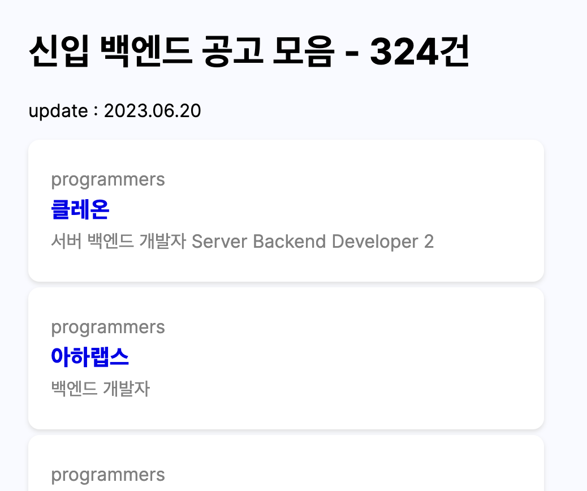

# Gongomoa :: 신입 개발자를 위한 채용 공고
[공고모아 :: 채용사이트 너무 많다](https://gongomoa.vercel.app/)

---

너무 많아져버린 채용 사이트에 지쳐, 신입 개발자에게 맞는 채용 공고를 한 곳에 모아봤어요.

- 현재 프론트엔드, 백엔드만 지원하고 있어요.
- 추 후, 수요도에 따라 분야를 늘리고자 해요.

아이디어가 생기는대로 새로운 기능을 업데이트하고 있어요.

**Skill** : Typescript, next13, mongodb,cheerio, peppeteer
그 회사를 검색했을 때, next seo의 장점을 빌어 연관으로 보였으면 좋겠네요.

---

## 🤷🏻‍♂️ 왜?

> 저는 웹 개발자 구직자에요.

취업을 위해 `원**, 사**, 잡***, 프****, 점*, 랠*, ……` 등 너무 많은 채용공고 사이트를 뒤지고 다니는게 번거로웠어요.

첫 번째로, 저에게 도움이 되는 도구를 만들고자 했어요.

두 번째로, 저와 같은 위치에 있는 누군가에게도 도움이 될 것 같아 배포하기로 했어요.
> 

---

## 💅🏼 디자인

기능을 우선시하여, 아직 디자인을 완료하지 못했어요.

어느정도 기능이 나왔으니 사용성을 고려한 UI를 제공하고자 해요.

---

## 📓 사용 설명서

현재 공고모아는 3개의 카테고리 중, **프론트엔드, 백엔드** 직무의 채용공고만 지원하고 있어요.

원하는 직무를 누르고, 원하는 공고를 눌러 확인해보세요.

채용 공고는 아웃링크로, 채용사이트로 연결해드려요.

편의를 위한 더 많은 기능을 추가하기 위해 노력해볼게요.

*찜, 핫한 공고, 좋아요, 싫어요 등~*

version 2.0에서 봐요!

---

## 🛠️ Change Log

### V. 1.0.0

> MVP 초기 모델
프론트엔드, 백엔드 직무의 채용 공고 지원 중.
>
